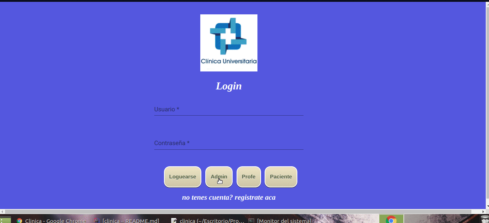

# Clinica Online

## Registro

Para registrarse debe ingresar al link que se encuentra abajo de login.

Podra registrarse como paciente o profesional.

Para poder registrarse como administrador de la aplicacion debera ser
registrado por otro del mismo perfil.

Registro para paciente :

Registro para Profesional :

Registro para Administradores:

## Login

Para loguearse como paciente y como administrador debe tener una cuenta creada con tal perfil y debera 
validar su identificacion mediante un correo verificador.

Logueo como paciente :

Logueo como profesional :

logueo como administradores: 

## Cargar horarios para los profesionales

para cargar los horarios debera registrarse con un profesional
debe ir a la solapa carga de horarios
seleccionar algun rango de la semana o tambien puede elegir un dia especifico
debe elegir el horario en el que desea atender 

## Detalle de turnos cargados 

usted podra ver el detalle de los turnos que cargo en la solapa "Mis Turnos Agendados"

Profesional:

Paciente:

## Cancelacion del turno por parte del profesional

usted podra cancelar esos turnos que ha cargado anteriormente
y lo podra hacer en la solapa "Mis turnos Agendados"

Profesional:

Paciente:

## Historico de turnos 

Para profesional y paciente: 

- En la solapa "Historial de turnos" podra ver los turnos finalizados
y cancelados

Profesional: 

Paciente:

## Reservar un turno

Usted podra reservar un turno con un paciente.
Debe ir a la solapa solicitud de turnos
puede realizar la busqueda por especialidad o por apellido del profesional

Paciente:

por especialidad:

por apellido:

## Validar Especialidad para profesionales

Para validar la especialidad de los profesionales
debera loguearse con una cuenta administradora y debe ir 
a la solapa "Verificacion de especialidad"

Administrador:

#Atencion de los pacientes

La atencion se realiza en la solapa "Mis Turnos Agendados" tanto
para paciente como para profesional

Paciente : 
-Inicia la consulta y carga la reseña 

Profesional:
-Inicia la consulta y carga la reseña y la historia clinica del turno
que serian los datos adicionales

## Agregar reportes en PDF

Para obtener los informes se debe loguearse con una cuenta de administradora
debe ir a la solapa informes y podra obtener:

- Los días y horarios que se Ingresaron al sistema en un lapso de tiempo
- Cantidad de operaciones de todos por especialidad
- Cantidad de turnos por día de la semana

## Informes en proceso 

- Médicos por cantidad de turnos dados en un lapso de tiempo.
- Médicos por cantidad de días que trabajaron en un lapso de tiempo.
- graficos estadisticos

## Busquedas de informacion 

en proceso .....

## Traduccion 

en proceso ....

