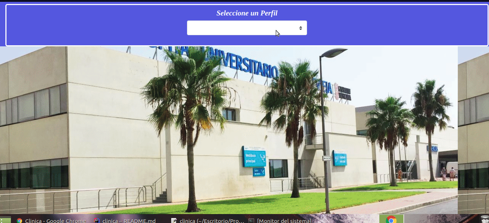

# Clinica Online

## Registro

Para registrarse debe ingresar al link que se encuentra abajo de login.

Podra registrarse como paciente o profesional.

Registro para paciente :

Registro para Profesional :

Registro para Administradores:

## Login

Para loguearse como paciente debe tener una cuenta creada con tal perfil y debera 
validar su identificacion mediante un correo verificador.

Logueo como paciente :

Logueo como profesional :

## Reservar un turno

en proceso ....

## Carga de horarios de profesionales

en proceso .....

## Cancelacion de turnos

En proceso......

## Validar Especialidad para profesionales

en proceso ....

## Validar al profesional para que pueda atender

en proceso ....

#Atencion de los pacientes

en proceso ....

##Agregar historia Clinico

en proceso ....

## Agregar encuesta 

en proceso ....
